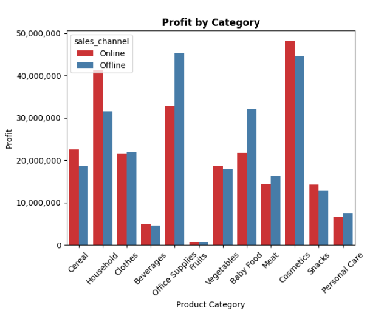
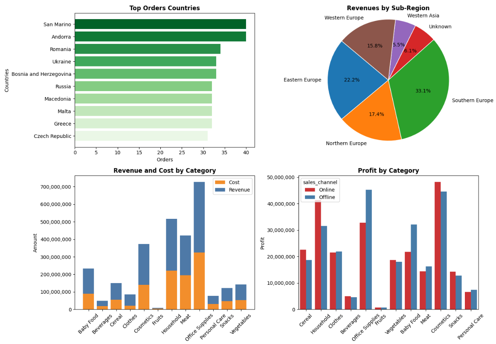
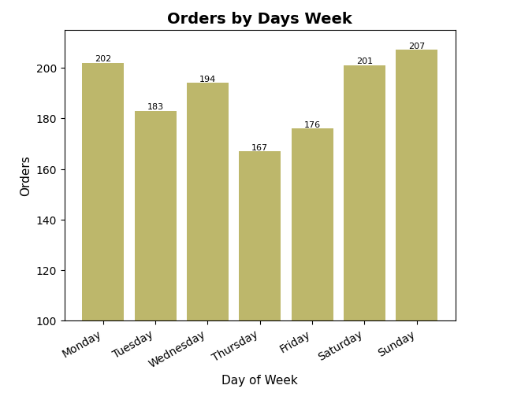

# Full Data Analysis Workflow on a Sales Dataset

## Project Overview

This project demonstrates a complete data analysis workflow using a real-world sales dataset.
The objective is to transform raw transactional data into structured insights through data cleaning, preprocessing, exploratory analysis, and visualization.

The project follows a structured analytical pipeline:

- Data inspection and merging of three source tables

- Data cleaning and validation

- Feature engineering (Revenue, Total Cost, Profit)

- Exploratory Data Analysis (EDA)

- Business insight extraction

This notebook reflects a real-world data analyst approach rather than isolated visualizations.

## Tools & Libraries

- Python

- Pandas

- NumPy

- Matplotlib

- Seaborn

## Dataset

The project uses three source datasets that are merged into a single analytical dataframe:

**Events** — transactional sales records:

- `order_id` – unique order identifier

- `order_date` – date of purchase

- `ship_date` – shipping date

- `order_priority` – order priority level

- `country_code` – country of sale

- `product_id` – product identifier

- `sales_channel` – sales channel (Online / Offline)

- `units_sold` – number of units sold

- `unit_price` – price per unit

- `unit_cost` – cost per unit

**Products** — product catalog with `id` and `item_type`

**Countries** — country reference with `alpha-3`, `region`, `sub-region`

## Data Preparation

The following preprocessing steps were performed:

- Data structure inspection across all three tables

- Data type corrections (date conversion for `order_date` and `ship_date`)

- Missing value handling (country codes filled with "Unknown", `units_sold` filled with mean)

- Cyrillic-to-Latin character normalization and duplicate check

- Merging tables via `product_id` and `country_code`

- Creation of calculated metrics: Revenue, Total Cost, Profit

## Exploratory Data Analysis

### Revenue & Profit by Category

- The most profitable category is **Cosmetics**, the least profitable is **Fruits**.

- The highest revenue and costs are in the **Office Supplies** category.

- Profit distribution between Online and Offline channels is relatively close in value across categories.



### Geographic Performance

- Top countries by order volume: **San Marino**, **Andorra**, **Romania**

- Revenue by sub-region: **Southern Europe** leads (33.1%), followed by **Eastern Europe** (22.2%) and **Northern Europe** (17.4%)



### Shipping Interval Analysis

- Average shipping interval varies by category; the longest delays are in **Office Supplies** and **Cereal**

- By country: longest shipping time in **Hungary**, shortest in **Croatia**

- By region: delivery in **Asia** takes longer than in **Europe**

### Profit vs Shipping Interval

- No direct linear relationship between shipping time and profit

- Profit is distributed evenly across the entire range (1–50 days), meaning delivery time does not significantly affect profitability


### Sales Dynamics Over Time

- Revenue dynamics differ across categories and countries — no single general trend

- European region shows significantly higher values compared to Asia, with more volatile dynamics

### Orders by Day of Week

- Most orders are placed on **Sunday** (207), fewest on **Thursday** (167)

- Distribution is relatively even across most categories, with some exceptions: Household sales dip on Tuesday, Fruits sales peak on weekends



## Key Insights

- The most profitable category is **Cosmetics**; the least profitable is **Fruits**

- Online and Offline channels show relatively similar profit distribution across categories

- **Southern Europe** generates the largest share of revenue (33.1%)

- Shipping interval does not significantly affect profitability

- Delivery in Asia takes longer than in Europe

- Sunday has the highest order volume; Thursday has the lowest

- Revenue dynamics vary across categories and regions with no single universal trend

## How to Run

1. Clone this repository

2. Install dependencies:

```bash
pip install -r requirements.txt
```

3. Open [`data_analysis_workflow.ipynb`](data_analysis_workflow.ipynb) in Jupyter Notebook or Google Colab

## Project Structure

```
full-data-analysis-workflow/
├── images/
│   ├── plots.png
│   ├── profit_category.png
│   ├── profut_vs_shipping.png
│   └── order_day_week.png
├── data_analysis_workflow.ipynb
├── requirements.txt
└── README.md
```
